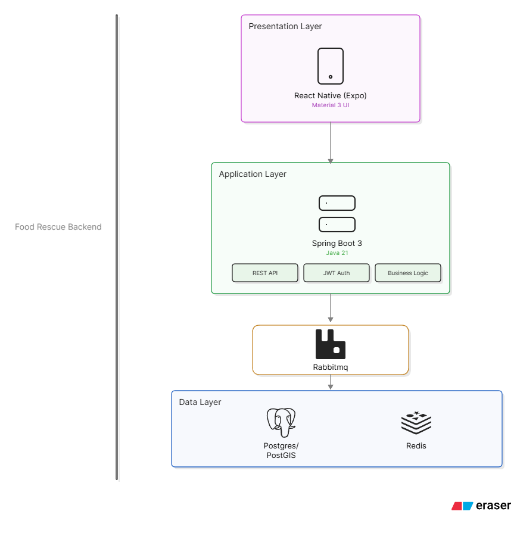

# Food Rescue Platform

A digital platform designed to connect food donors with non-governmental organisations (NGOs) and facilitate the redistribution of surplus food to communities that need it.

---

## Overview

Food waste is a significant social and environmental problem. Restaurants, supermarkets, farms, bakeries, hotels, and other food-related organisations can have surplus food that is still suitable for consumption but may not have an efficient way to redistribute it.

At the same time, NGOs and community organisations often need access to food donations but may struggle to discover available donations, coordinate collections, and manage the donation process efficiently.

The **Food Rescue Platform** was developed to address this gap by creating a centralised digital system where donors can publish available food and NGOs can discover and claim donations.

The project focuses on making the process more structured, transparent, and accessible while providing a foundation for managing food donations from creation through to collection.

---

## Problem Statement

Food that could still be consumed is often wasted because there is no efficient connection between organisations with surplus food and organisations that can redistribute it.

The problem involves several challenges:

* Food donors may not have a centralised way to advertise surplus food.
* NGOs may have difficulty discovering available donations.
* Donation information can be communicated through fragmented channels.
* There is limited visibility into the status of individual donations.
* Managing donor and organisation information manually can become inefficient.
* Food donations are often time-sensitive because of expiry dates and collection windows.
* Tracking the impact of donations can be difficult without structured data.

The Food Rescue Platform aims to provide a digital workflow that connects these two sides of the problem.

---

## Proposed Solution

The Food Rescue Platform provides separate experiences for **Donors** and **NGOs**.

### Donors

Donors can:

* Register as a donor organisation.
* Create and manage their organisation profile.
* Create food donation listings.
* Capture or upload images of donated food.
* Provide food quantity and category information.
* Specify expiry dates.
* Provide pickup addresses and pickup windows.
* Allow partial claims where applicable.
* View their existing donations.
* Track donation statuses.
* View donation statistics and impact information.
* Update their organisation profile.

### NGOs

The platform is designed to allow NGOs to:

* Register their organisation.
* Discover available food donations.
* View donation information.
* Identify suitable donations.
* Claim available donations.

The platform therefore creates a digital connection between organisations that have surplus food and organisations that can help redistribute it.

---

## Key Features

### Authentication and Authorisation

The application supports authenticated users and role-based access.

Current organisation roles include:

* `DONOR`
* `NGO`

Role-based access ensures that users are directed to functionality appropriate to their organisation type.

---

### Organisation Onboarding

New users complete an organisation setup process after registration.

The onboarding process collects relevant organisation information through a step-by-step interface instead of presenting all fields on a single screen.

For donors, this includes information such as:

* Organisation name
* Organisation type
* Contact person
* Address
* Location

---

### Donor Profiles

Donor organisations have profiles containing:

* Organisation name
* Organisation type
* Address
* Contact person
* Phone number
* Geographic coordinates
* Average rating

The backend also provides donor impact statistics such as:

* Total listings
* Active listings
* Completed claims
* Total kilograms donated
* Average rating

---

### Food Donation Listings

Donors can create food donation listings containing information such as:

* Donation title
* Description
* Food category
* Quantity in kilograms
* Expiry date
* Pickup address
* Pickup coordinates
* Pickup window
* Pickup notes
* Partial-claim availability
* Images

Donation listings move through different statuses during their lifecycle, including:

```text
AVAILABLE
CLAIMED
COMPLETED
EXPIRED
```

---

### Image Capture

The mobile application supports capturing donation images using the device camera as well as selecting images from the device gallery.

Images are uploaded before the donation listing is created.

This allows donors to provide visual information about the food they are offering.

---

### Location Support

The application supports geographic coordinates for organisation and donation locations.

Location information can be used for:

* Pickup coordination
* Map-based functionality
* Nearby donation discovery
* Distance-based searches

---

### Donation Statistics

The donor dashboard provides an overview of donation activity, including:

* Total donations
* Available donations
* Completed donations

The donor profile also exposes impact statistics provided by the backend.

---

## Technology Stack

### Backend

* Java
* Spring Boot
* Spring Security
* Spring Data JPA
* Hibernate
* PostgreSQL
* Liquibase
* JWT-based authentication

### Frontend

* Flutter
* Dart
* Riverpod
* GoRouter
* HTTP
* Geolocator
* Image Picker

### Development Tools

* Git
* GitHub
* Android Studio / VS Code
* Postman
* Docker

---

## Architecture

The project follows a client-server architecture.



The backend exposes REST endpoints consumed by the Flutter application.

---

## Backend API Structure

The API is organised around the application's primary resources:

```text
/api/v1/auth
/api/v1/donors
/api/v1/ngos
/api/v1/listings
/api/v1/claims
/api/v1/notifications
```

### Donor API

Examples include:

```http
POST /api/v1/donors
GET  /api/v1/donors/me
GET  /api/v1/donors/{id}
PUT  /api/v1/donors/{id}
GET  /api/v1/donors/me/stats
GET  /api/v1/donors/{id}/stats
```

### Listing API

The platform supports operations for:

```text
Creating listings
Retrieving listings
Retrieving active listings
Finding nearby listings
Updating listings
Updating listing status
Deleting listings
Claiming listings
```

---

## Database and Data Migration

Database schema changes are managed using **Liquibase**.

Instead of relying on manually modifying the database whenever the application changes, database changes are represented as version-controlled migration scripts.

This provides a more controlled approach to database evolution.

The migration process allows the project to:

* Track database changes.
* Version schema modifications.
* Apply changes consistently across environments.
* Keep database structure aligned with application development.
* Reduce dependency on manual database changes.

Liquibase became particularly important as the project moved from its initial development stage into a more structured backend and database implementation.

---

## Security

The backend uses authentication and role-based authorisation.

Authenticated requests use JWT access tokens.

The system distinguishes between users based on their organisation role.

For example:

```text
DONOR
  ├── Manage donor profile
  ├── Create donations
  └── Manage donations

NGO
  └── Discover and interact with available donations
```

Backend endpoints are protected according to the user's permissions and role.

---

## Donor Workflow

The current donor workflow is designed around a simple sequence:

```text
Register
   ↓
Login
   ↓
Organisation Setup
   ↓
Donor Dashboard
   ↓
Create Donation
   ↓
Add Food Details
   ↓
Add Expiry & Description
   ↓
Add Pickup Information
   ↓
Capture / Select Images
   ↓
Review
   ↓
Publish Donation
```

After publishing, the donor can monitor their donations through the application.

---

## Frontend Navigation

The donor application uses a dedicated navigation structure:

```text
Donor
├── Home
│   ├── Donation statistics
│   ├── Recent donations
│   └── Donate Food
│
├── My Donations
│   ├── Available
│   ├── Claimed
│   ├── Completed
│   └── Expired
│
└── Profile
    ├── Organisation details
    ├── Contact details
    ├── Impact statistics
    └── Edit Profile
```

The donation creation process is intentionally separated into multiple steps to avoid overwhelming the donor with a large form.

---

## Development Journey

This project has been developed incrementally, with each stage addressing a different part of the system.

### Week 1 — Project Foundation

The initial work focused on establishing the project foundation, defining the problem, identifying the main users, and setting up the initial application structure.

### Week 2 — Backend and Application Development

Development progressed into authentication, organisation roles, backend services, API development, and the initial application workflow.

### Week 3 — Data Migration

Database development became a major focus during Week 3.

Liquibase was introduced to manage database schema changes through version-controlled migrations.

This moved the project toward a more reliable and maintainable database development workflow.

### Week 4 — Frontend Technology Transition

During Week 4, the mobile frontend technology was changed from **React Native to Flutter**.

The transition allowed development to continue using Flutter and Dart, with the frontend progressively integrating with the existing Spring Boot backend.

Current frontend development includes:

* Authentication
* Organisation onboarding
* Donor dashboard
* Multi-step donation creation
* Camera and gallery image selection
* Donor navigation
* Donor profile
* Profile editing
* Donation management

---

## Current Status

The project is currently in active development.

The core donor workflow is being developed around the following architecture:

```text
Flutter
   ↓
REST API
   ↓
Spring Boot
   ↓
PostgreSQL
```

The application already has a working foundation for authentication, organisation onboarding, donor profiles, food donation creation, image handling, donor navigation, and donation management.

Further development will focus on expanding the NGO workflow, improving claim management, strengthening validation and authorisation, refining the user experience, and completing additional platform functionality.

---

## Project Goals

The long-term goal is to create a platform that makes food redistribution more structured and accessible.

The project aims to demonstrate how software engineering can be applied to a real-world problem involving:

* Food waste reduction
* Community support
* Organisation coordination
* Data management
* Location-based services
* Mobile application development
* Secure REST APIs
* Database versioning
* Role-based systems

---

## What I Am Learning

This project has provided practical experience across multiple areas of software development, including:

* REST API design
* Spring Boot development
* JWT authentication
* Role-based authorisation
* PostgreSQL database design
* Database migrations with Liquibase
* Flutter development
* Riverpod state management
* GoRouter navigation
* Mobile camera and image handling
* Geolocation
* API integration
* Git-based development
* Incremental software development
* Frontend technology migration

One of the most valuable aspects of the project has been learning that software development is not only about implementing features. It also involves making architectural decisions, managing change, maintaining data integrity, and adapting when an existing technical approach is no longer the best fit.

---

## Future Improvements

Planned improvements include:

* Complete NGO functionality
* Enhanced donation discovery
* Improved claim management
* Donation detail screens
* Push notifications
* Improved location-based discovery
* Rating and review functionality
* Enhanced donor impact analytics
* Improved error handling
* Additional security and authorisation checks
* Production deployment
* Automated testing
* CI/CD improvements

---

## Project Structure

A simplified view of the project is:

```text
FoodRescue/
│
├── Backend/
│   ├── src/
│   │   └── main/
│   │       ├── java/
│   │       └── resources/
│   │
│   └── pom.xml
│
└── frontend/
    ├── lib/
    │   ├── core/
    │   ├── models/
    │   ├── providers/
    │   ├── repositories/
    │   ├── screens/
    │   ├── services/
    │   └── router.dart
    │
    └── pubspec.yaml
```

---

## Getting Started

### Backend

Clone the repository and configure the backend environment with the required PostgreSQL database and application configuration.

Then run the Spring Boot application.

```bash
./mvnw spring-boot:run
```

On Windows:

```bash
mvnw.cmd spring-boot:run
```

### Flutter

Navigate to the Flutter project:

```bash
cd frontend
```

Install dependencies:

```bash
flutter pub get
```

Run the application:

```bash
flutter run
```

---

## Project Status

**Status:** In Development

**Backend:** Spring Boot + PostgreSQL

**Mobile:** Flutter

**Database Migration:** Liquibase

**Authentication:** JWT

**Primary Roles:** Donor / NGO

---

## Author

**Gift Mbatha**

Software Developer | ICT: Application Development

This project is being developed as a practical software engineering project focused on solving a real-world food redistribution problem through technology.
